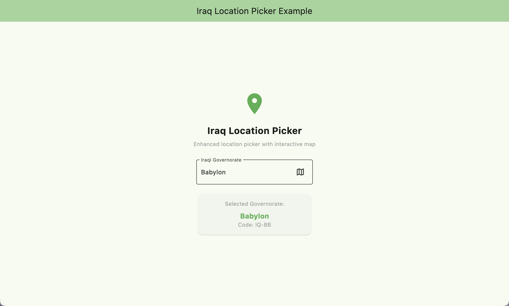
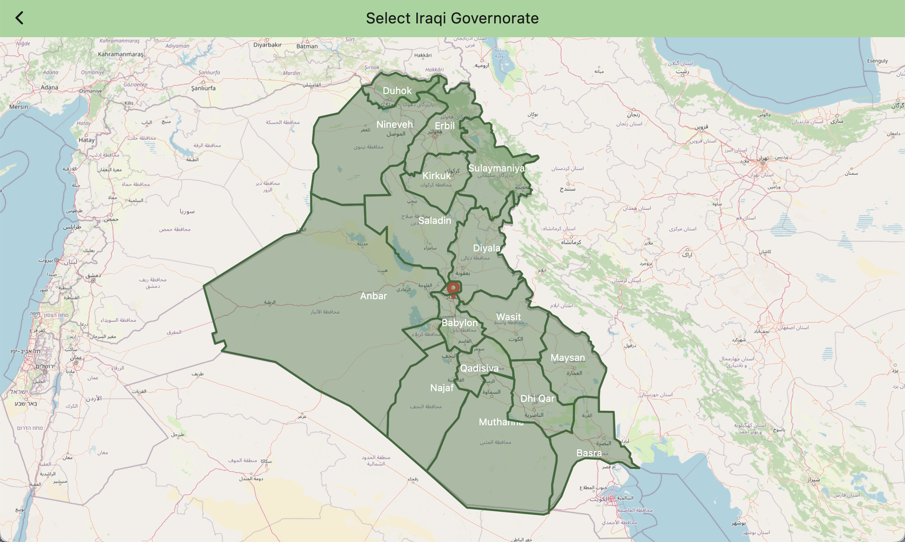

# Iraq Location Picker Example

This example demonstrates how to use the Iraq Location Picker package in a Flutter application.

## 🌐 Live Demo
Try the interactive demo: **[https://anasjasim.github.io/iraq_location_picker/](https://anasjasim.github.io/iraq_location_picker/)**

## 📸 Screenshots

<div align="center">
  
  <br/>
  <em>Main location picker with dropdown and map integration</em>
  <br/><br/>
  
  <br/>
  <em>Interactive map showing all Iraqi governorates with clickable polygons</em>
</div>

## Features Demonstrated

🎯 **Complete Implementation**
- `IraqGovernorateLocationPickerWidget` with dropdown and map functionality
- Custom display of selected governorate information
- Interactive map integration
- Error handling and loading states

📱 **User Experience**
- Clean, modern UI with proper spacing and typography
- Visual feedback for selections
- Smooth navigation between dropdown and map
- Responsive design for different screen sizes

## Running the Example

1. **Navigate to the example directory:**
```bash
cd example
```

2. **Get dependencies:**
```bash
flutter pub get
```

3. **Run on your preferred platform:**
```bash
# Desktop (macOS)
flutter run -d macos

# Web
flutter run -d chrome

# Mobile
flutter run
```

## Code Structure

### Main App (`lib/main.dart`)

The example shows a complete implementation with:

- **Header Section**: Title, icon, and description
- **Location Picker**: The main `IraqGovernorateLocationPickerWidget`
- **Results Display**: Shows selected governorate details in a card

### Key Implementation Details

```dart
// State management
IraqGovernorate? selectedGovernorate;

// Callback handling
void _onGovernorateSelected(IraqGovernorate? governorate) {
  setState(() {
    selectedGovernorate = governorate;
  });
  
  // Add your custom logic here
  if (governorate != null) {
    debugPrint('Selected: ${governorate.governorateCode}');
  }
}

// Widget usage
IraqGovernorateLocationPickerWidget(
  selectedGovernorate: selectedGovernorate,
  onGovernorateSelected: _onGovernorateSelected,
)
```

## Customization Examples

### Custom Styling

```dart
IraqGovernorateLocationPickerWidget(
  hintText: 'Choose your location',
  labelText: 'Location',
  onGovernorateSelected: _handleSelection,
)
```

### Integration with Forms

```dart
Form(
  child: Column(
    children: [
      TextFormField(/* other fields */),
      IraqGovernorateLocationPickerWidget(
        selectedGovernorate: _selectedGovernorate,
        onGovernorateSelected: (governorate) {
          setState(() => _selectedGovernorate = governorate);
        },
      ),
      ElevatedButton(/* submit */),
    ],
  ),
)
```

## Features Used

- ✅ Dropdown selection with all 18 Iraqi governorates
- ✅ Interactive map with clickable polygons
- ✅ Asset loading from package
- ✅ Error handling and loading states
- ✅ Material Design components
- ✅ Responsive layout

## Next Steps

This example shows the basic usage. You can extend it by:

- Adding form validation
- Integrating with databases
- Adding custom styling themes
- Implementing search functionality
- Adding location-based services
